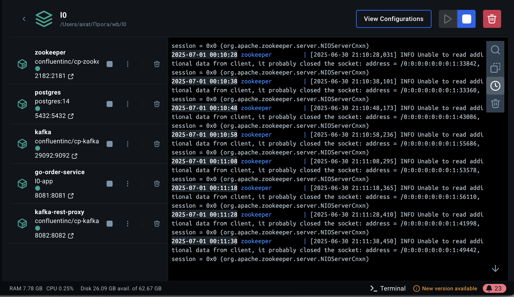
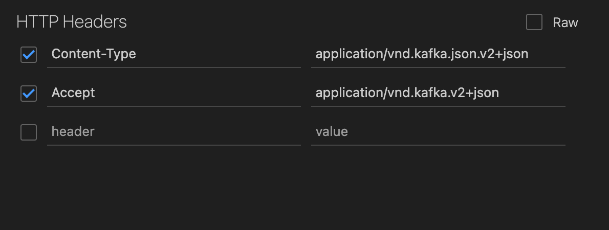
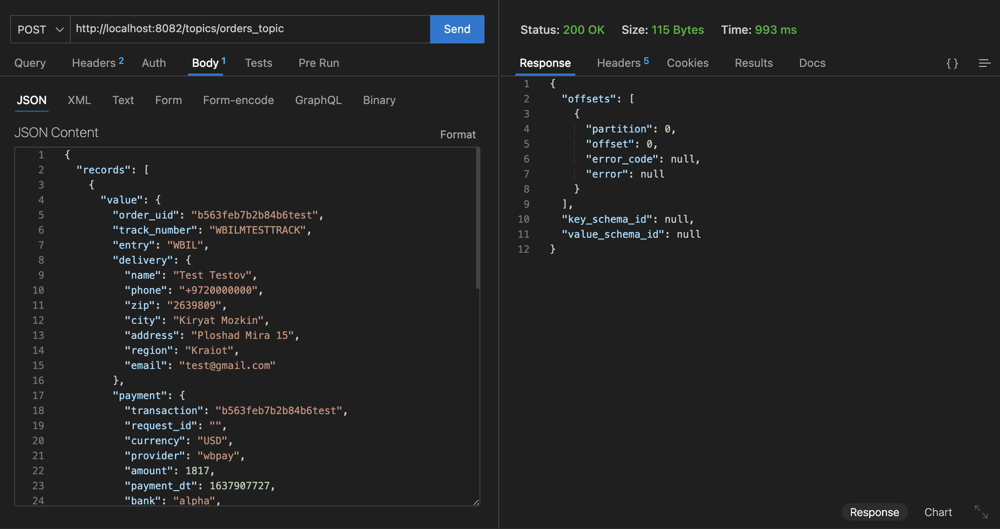
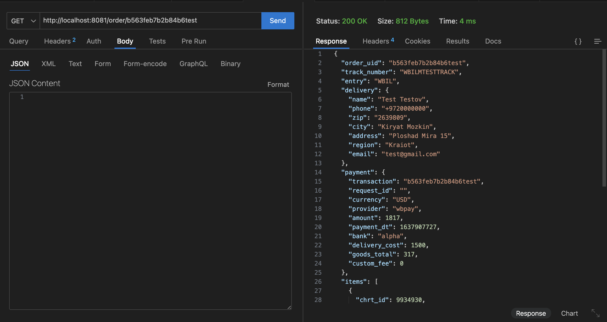
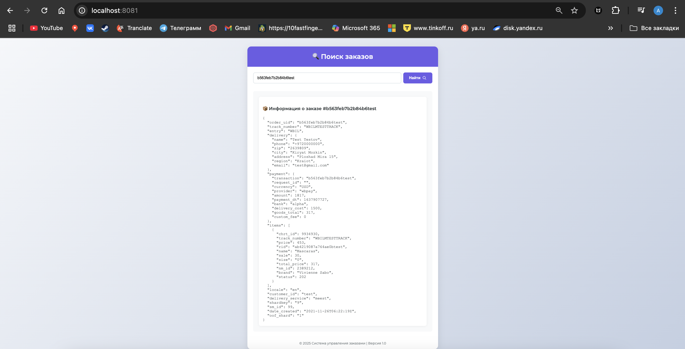

# Order Service (L0)

🧾 Демонстрационный микросервис на Go, который принимает заказы из Kafka, сохраняет их в PostgreSQL, кэширует в памяти и предоставляет API для получения информации по `order_uid`.

---

## 🧩 Архитектура

- **Go (Golang)** — основной язык приложения
- **PostgreSQL** — база данных для хранения заказов
- **Kafka** — брокер сообщений (через `cp-kafka`)
- **Kafka REST Proxy** — для удобной отправки сообщений из Postman / Thunder Client
- **In-memory cache (Go map)** — для ускоренного доступа
- **HTML-интерфейс** — для просмотра заказов по ID

---

## 🚀 Запуск проекта

**make all**

Или вручную:

**docker compose up --build -d**

-  При этом автоматически запускаются:

- PostgreSQL с БД ordersdb

- Kafka + Zookeeper

- Kafka REST Proxy (порт 8082)

- Go-сервис (порт 8081)

---
## ⚙️ Миграции

Все таблицы создаются при старте PostgreSQL через файл:

init.sql

Если нужно вручную применить миграции:

make init-db
---
## 🧪 Демонстрация в Docker
Работоспособность контейнеров

На видео я покажу:

- make up — запуск всех сервисов в контейнерах

- make logs — подтверждение, что Go-сервис подключился к Kafka и БД

- Отправку JSON заказа через Kafka (из model.json)

- Появление записи в логах (Order ... saved and cached)

- Получение заказа через:

- HTTP API: curl http://localhost:8081/order/<order_uid>

- Веб-интерфейс по адресу http://localhost:8081 

---
## 📨 Отправка заказа в Kafka
Thunder Client / Postman
URL: http://localhost:8082/topics/orders_topic

Method: POST

Headers:
Content-Type: application/vnd.kafka.json.v2+json

Accept: application/vnd.kafka.v2+json

Body → raw → JSON:

{
  "records": [
    {
      "value": { /* содержимое model.json */ }
    }
  ]
}

---
### 🌐 HTTP API
GET /order/{order_uid} — получить заказ по ID (из кэша или БД)

Пример:

---
### 🧠 Кэш
Все заказы хранятся в map[string]Order

При старте приложения кэш заполняется из базы

Кэш ускоряет повторные обращения по order_uid

---

## 🧪 Makefile команды

| Команда         | Описание                              |
|-----------------|---------------------------------------|
| `make all`      | Сборка и запуск всех сервисов         |
| `make up`       | Запуск Docker Compose                 |
| `make down`     | Остановка и удаление volume'ов        |
| `make restart`  | Перезапуск с пересборкой              |
| `make logs`     | Логи Go-сервиса                       |
| `make psql`     | Вход в PostgreSQL                     |
| `make kafka-send` | Kafka CLI-производитель сообщений    |
| `make create-topic` | Ручное создание Kafka-топика       |
| `make init-db`  | Инициализация таблиц в БД             |

## 🖥️ Интерфейс
Перейдите в браузере:

http://localhost:8081
Введите order_uid → получите JSON-ответ.